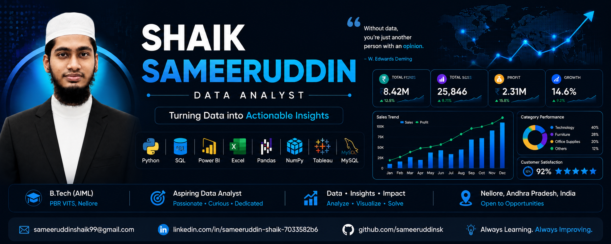

  

# Hi 👋, I'm Shaik Sameeruddin

<h3 align="center">Aspiring Data Analyst | Python | SQL | Power BI | Excel</h3>

---

## 👨‍💻 About Me

- 🎓 B.Tech in Artificial Intelligence & Machine Learning
- 📍 Nellore, Andhra Pradesh, India
- 📊 Aspiring Data Analyst
- 💡 Passionate about Data Analytics, Business Intelligence & Visualization
- 🌱 Learning: Advanced SQL, Statistics, Microsoft Fabric & Data Warehousing

---

## 🛠️ Tech Stack

### Languages

### Web

### Data Analytics

### Database & Tools

---

## 🚀 Featured Projects

| Project | Tech |
|---|---|
| 📊 Sales Data Analysis Dashboard | Python • SQL • Excel • Power BI |
| 📈 HR Analytics Dashboard | Power BI • SQL • Excel |
| 🤖 Customer Churn Prediction | Python • SQL • Scikit-learn |
| 🌐 Responsive Portfolio Website | HTML • CSS • JavaScript |

---

## 💼 Virtual Internships

- Tata Group – Data Visualisation (Forage)
- Deloitte Australia – Data Analytics (Forage)
- Quantium – Data Analytics (Forage)

---

## 📜 Certifications

- Cisco Data Analytics Essentials
- AICTE Full Stack Java Internship
- NPTEL – Introduction to Internet of Things (Elite)

---

## 📊 GitHub Stats

---

## 🏆 GitHub Trophies

---

## 📈 Contribution Graph

---

## 👀 Profile Views

---

## 🌱 Currently Learning

- Advanced SQL
- Statistics
- Microsoft Fabric
- Data Warehousing
- Advanced Power BI

---

## 💬 Quote

> "Without data, you're just another person with an opinion."  
> — W. Edwards Deming

---

## 🐍 Contribution Snake

  

⭐ If you like my projects, consider starring them!

